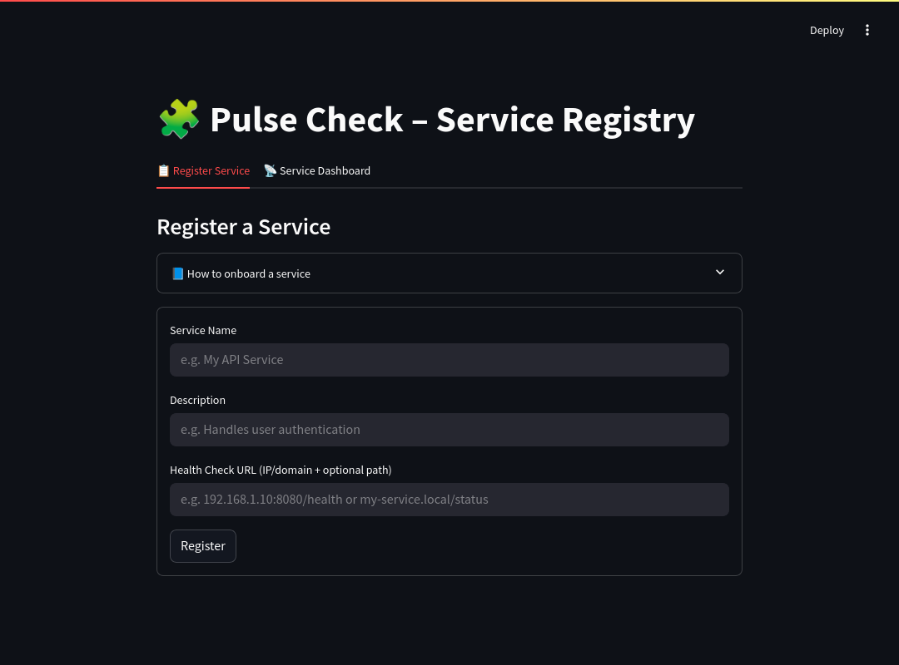
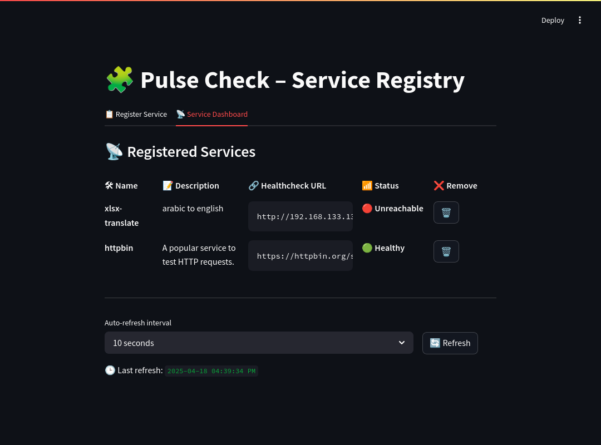

# PulseCheck

**Pulse Check** is a lightweight service monitoring dashboard for teams that need quick visibility into the status of internal or external APIs and microservices.

It lets you register services with a health check endpoint and automatically pings them at configurable intervals, displaying real-time status in a simple web UI.

<details>
  <summary>Full Page Sample</summary>
  <br>
  <div align="center">
    
  </div>
  <div align="center">
    
  </div>
</details>

---

### Start the Application

Run the following command to build and start the containers:  

```bash
docker compose up -d
```

This will: 

1. Build the Docker images for the FastAPI and Streamlit services.  
2. Start the containers and serve the application.  

---

## Features

- **Health Status Detection**:  
  Services are marked as `healthy`, `unhealthy`, or `unreachable` based on /health endpoint responses.

- **Toast Notifications**:  
  Instant feedback on status changes (e.g. unhealthy to healthy).

- **Auto & Manual Refresh**:  
  Choose from preset auto-refresh intervals or manually ping all services.

- **Simple Registration Form**:  
  Register any service with a name, description, and URL — supports IP, domain, or full HTTPS URLs.

- **Persistent Service Storage**:  
  Registered services are saved to `services_data/services.json` and reloaded on startup.

---

## Prerequisites

Before you start, ensure the following tools are installed on your system:

- Docker  
- Docker Compose  

---

## Access the Application

- **FastAPI Backend**:  
  Visit <http://localhost:8000> to access the API.  
  Documentation is available at <http://localhost:8000/docs>  

- **Streamlit Frontend**:  
  Visit <http://localhost:8501> to interact with the frontend.  

---

## Development Workflow

### Live Reloading

Both FastAPI and Streamlit support hot reloading out of the box. Any changes you 
make to the code will automatically reflect in the running containers.  

### Stopping the Application

To stop the application, press `Ctrl+C` or run the following command:  

```bash
docker compose down  
```

This will stop and remove the containers, but the built images will remain.  

---

## Directory Structure

The project structure is as follows:  

```shell
.  
├── backend/
│   ├── main.py            # FastAPI entrypoint
│   ├── models.py          # Pydantic models for request/response schemas
│   ├── registry.py        # Core logic for registering and pinging services
│   ├── requirements.txt   # Python dependencies for FastAPI  
│   └── Dockerfile         # Dockerfile for FastAPI  
├── frontend/  
│   ├── app.py             # Streamlit entrypoint  
│   ├── Dockerfile         # Dockerfile for Streamlit
│   └── requirements.txt   # Python dependencies for Streamlit
├── services_data/
│   └── services.json      # Local service registry (auto-created and updated)
├── docker-compose.yml     # Docker orchestration file for backend and frontend
└── README.md              # Project documentation
```

---

## Troubleshooting

- Ensure Docker and Docker Compose are installed and running on your system.  
- Verify that the required ports (8000 and 8501) are not in use by other 
applications.  

---

## License

This project is licensed under the MIT License. See the LICENSE file for details.
